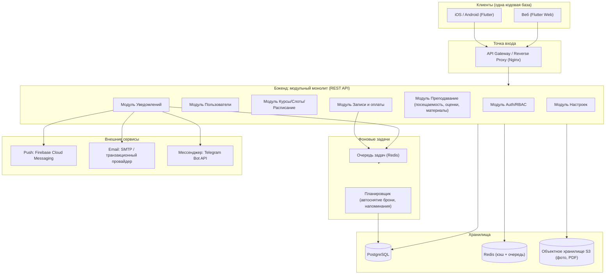
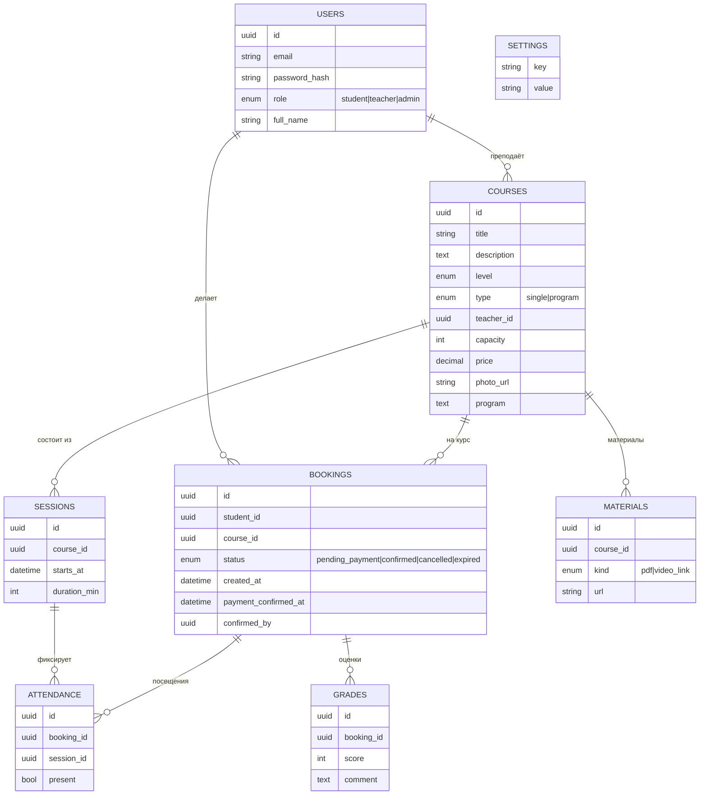
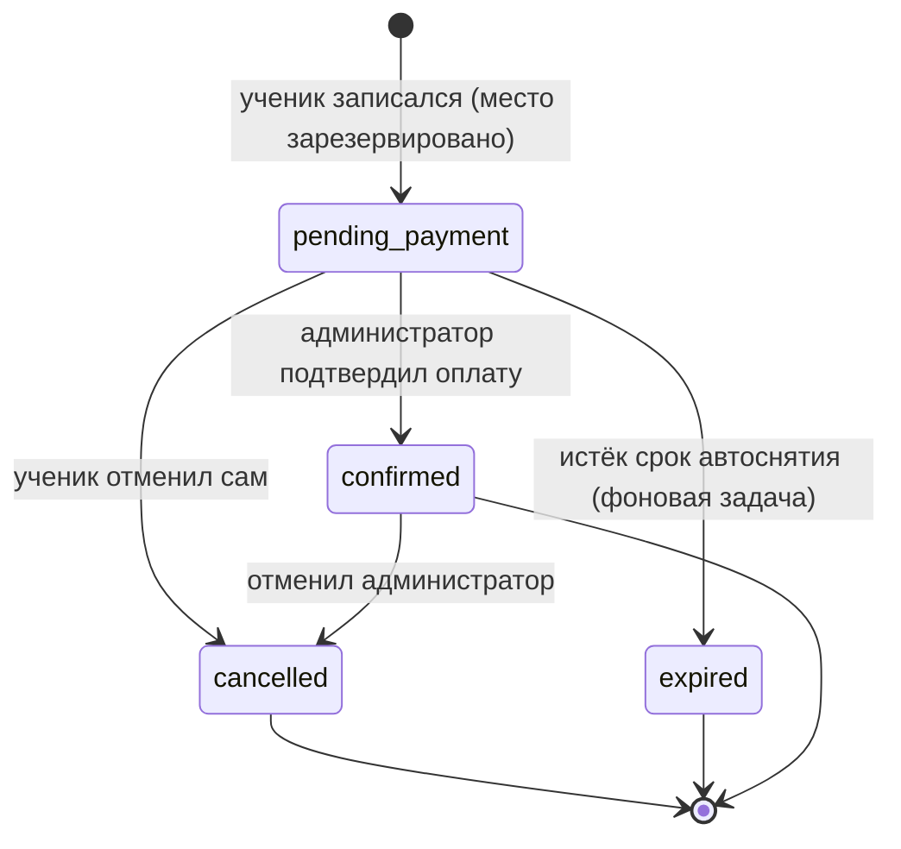

# Архитектура: Приложение для академии барберов (MVP)

Документ описывает предлагаемую архитектуру решения по ТЗ из `ТЗ_MVP_академия_барберов.md`. Цель — минимально достаточная, но расширяемая архитектура: быстро выпустить MVP и без переписывания добавить онлайн-оплату, мультифилиальность, аналитику и сертификаты на следующих этапах.

## 1. Принципы

- **Одна кодовая база на клиент** — минимизировать стоимость поддержки трёх платформ (iOS, Android, веб).
- **Модульный монолит на бэкенде** — проще, дешевле и быстрее микросервисов на этапе MVP; модули спроектированы так, чтобы при росте их можно было вынести.
- **Чёткое разделение слоёв** — API / бизнес-логика / доступ к данным / интеграции.
- **Конфигурируемость** — параметры вроде срока автоснятия брони хранятся в БД, а не в коде.
- **Готовность к расширению** — точки расширения для платежей, мультифилиальности и нотификаций заложены сразу (интерфейсы/абстракции).

## 2. Общая схема

## 3. Клиентское приложение

**Рекомендация: Flutter** — одна кодовая база на iOS, Android и веб. Подходит, т.к. это приложение для академии (SEO веба некритичен), а единый код существенно снижает стоимость MVP.

- **Архитектура клиента**: слоистая (UI → State management → Repository → API client).
  - State management: Riverpod или Bloc.
  - Сетевой слой: типизированный HTTP-клиент (Dio) + DTO + генерация моделей.
  - Локальное хранилище: secure storage для токенов, лёгкий кэш каталога.
- **Локализация**: только русский, но через стандартный механизм i18n (на будущее).
- **Push**: интеграция Firebase Messaging SDK.

**Альтернатива**: React Native (мобайл) + Next.js (веб) с общим слоем логики. Даёт лучший веб, но это две кодовые базы — дороже для MVP. Поэтому для MVP рекомендуется Flutter.

## 4. Бэкенд

**Рекомендация: модульный монолит, REST API.**

- **Технология**: NestJS (TypeScript) или Python (FastAPI/Django). Рекомендуется **NestJS** — строгая модульная структура «из коробки», DI, удобно вынести модули в сервисы позже. (Альтернатива — Django REST: быстрый старт, мощная admin-панель для администраторов академии.)
- **Стиль API**: REST + JSON, версионирование `/api/v1`. OpenAPI/Swagger для документации.
- **Слои внутри модуля**: Controller → Service (бизнес-логика) → Repository (ORM) .

### Модули
| Модуль | Ответственность |
|---|---|
| **Auth/RBAC** | Регистрация ученика, вход по email+паролю, выдача JWT (access+refresh), проверка ролей |
| **Users** | Профили; заведение администраторов и преподавателей администратором |
| **Courses** | Курсы, уровни, слоты, расписание, лимит мест, фото/программа |
| **Booking** | Записи, статусы брони, ручное подтверждение оплаты, отмена, автоснятие |
| **Teaching** | Списки учеников преподавателя, посещаемость, оценки, материалы (PDF/ссылки) |
| **Notifications** | Отправка событий в push/email/мессенджер через единый интерфейс |
| **Settings** | Конфигурируемые параметры (срок автоснятия брони и др.) |

## 5. Модель данных (основные сущности)

- **БД**: PostgreSQL — реляционная модель естественно описывает курсы/слоты/брони/места; транзакции критичны для контроля лимита мест.
- **Контроль лимита мест**: бронирование выполняется в транзакции с блокировкой (например, `SELECT ... FOR UPDATE` по агрегату курса), чтобы исключить превышение `capacity` при гонках.

## 6. Запись, оплата и автоснятие брони

Жизненный цикл брони (`BOOKINGS.status`):

- **Автоснятие**: фоновый планировщик периодически (или отложенной задачей в очереди при создании брони) проверяет `pending_payment` старше, чем `settings.booking_hold_timeout`, и переводит в `expired`, освобождая место.
- **Срок автоснятия** хранится в `SETTINGS` и редактируется администратором (без деплоя).
- **Права на отмену** контролируются RBAC: до подтверждения — ученик/администратор; после подтверждения — только администратор.

## 7. Уведомления

- **Единый интерфейс** `NotificationChannel` с реализациями: `PushChannel` (FCM), `EmailChannel` (SMTP/транзакционный провайдер), `MessengerChannel` (Telegram Bot API для MVP; WhatsApp Business API — на следующем этапе).
- **Асинхронная доставка** через очередь (Redis + воркеры), чтобы отправка не блокировала API и переживала временные сбои внешних сервисов (ретраи).
- **События**: подтверждение записи, напоминание об оплате, напоминание о начале занятия (планируется по `SESSIONS.starts_at`), отмена брони.

## 8. Аутентификация и безопасность

- Вход email + пароль; пароли хешируются (argon2/bcrypt).
- **JWT**: короткоживущий access-токен + refresh-токен.
- **RBAC**: роли `student | teacher | admin`; защита эндпоинтов через guard/middleware по ролям.
- Саморегистрация — только для роли `student`; администраторов и преподавателей создаёт администратор.
- HTTPS на всём периметре, валидация входных данных, rate limiting на auth-эндпоинтах.
- Хранение ПДн с учётом 152-ФЗ закладывается как требование следующего этапа (см. открытые вопросы ТЗ).

## 9. Хранилища и файлы

- **PostgreSQL** — основная БД.
- **Redis** — кэш (каталог, сессии) + брокер очереди задач.
- **Объектное хранилище (S3-совместимое)** — фото курсов и PDF-материалы. Видео не хранится — только внешние ссылки (по ТЗ).

## 10. Развёртывание (предложение для MVP)

- Контейнеризация (Docker), оркестрация для старта — Docker Compose; масштабирование при росте — Kubernetes.
- Компоненты: API (1–2 инстанса за reverse proxy), воркеры очереди, PostgreSQL, Redis, объектное хранилище.
- CI/CD: автосборка, прогон тестов, миграции БД, деплой.
- Наблюдаемость: централизованные логи, метрики, алерты; healthcheck-эндпоинты.

## 11. Точки расширения под отложенные этапы

| Будущая фича | Как заложено сейчас |
|---|---|
| Онлайн-оплата | Статусы брони и модуль Booking отделены от способа оплаты; добавляется `PaymentProvider` и статус `paid` без переделки модели |
| Мультифилиальность | Добавление сущности `Branch` и `branch_id` в `COURSES`/`USERS`; модель уже нормализована |
| Сертификаты | Новый модуль поверх `Teaching` (генерация PDF по завершении курса) |
| Аналитика/отчёты | Read-модели/витрины поверх существующих таблиц; данные уже собираются (брони, оплаты, посещаемость) |
| WhatsApp-уведомления | Новая реализация `NotificationChannel` без изменения вызывающего кода |

## 12. Рекомендуемый стек (итог)

- **Клиент**: Flutter (iOS, Android, Web), Riverpod/Bloc, Dio.
- **Бэкенд**: NestJS (TypeScript) — модульный монолит, REST, OpenAPI. (Альтернатива: Django REST.)
- **БД**: PostgreSQL.
- **Кэш/очередь**: Redis (+ BullMQ для NestJS).
- **Файлы**: S3-совместимое объектное хранилище.
- **Уведомления**: FCM (push), SMTP/транзакционный провайдер (email), Telegram Bot API (мессенджер).
- **Инфраструктура**: Docker, Nginx, CI/CD.
